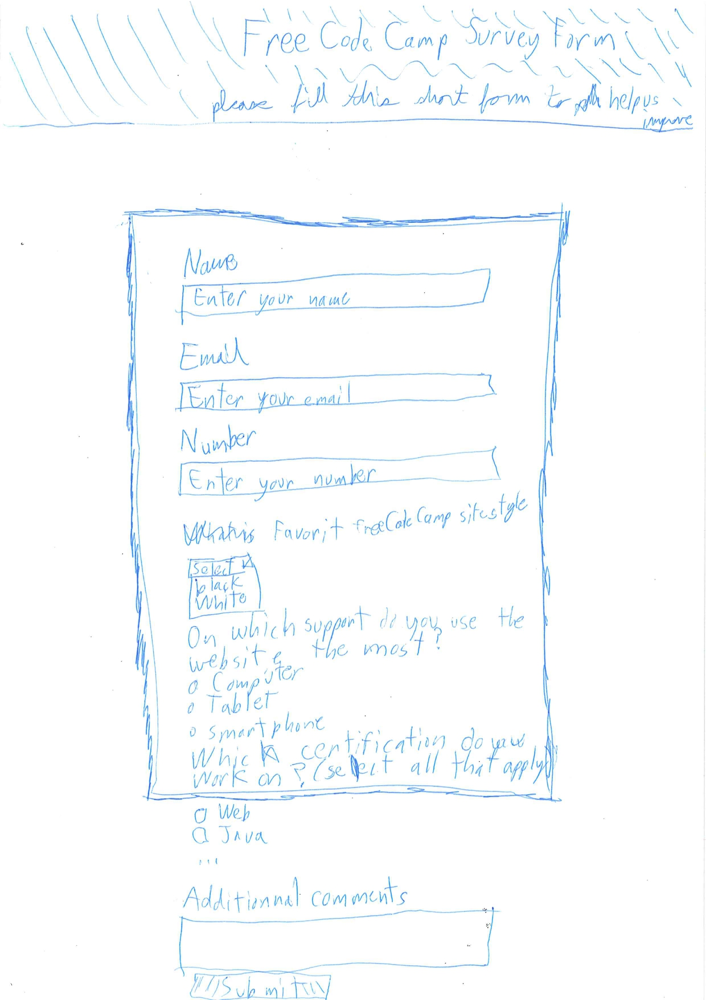

# Survey Form

This is the first project done to obtain the Free Code Camp Responsive Web Design certification.

<details>
  <summary>HTML code</summary>

```html

<!DOCTYPE html>
<html lang="en">
  <head>
    <meta charset="UTF-8">
    <title>Free Code Camp survey form</title>
    <link rel="stylesheet" href="styles.css" />
  </head>
  <body>
    <div id="form-header">  
      <h1 id="title">Free Code Camp Survey Form</h1>
      <p id="description">Please fill this short form to help us improve</p>
    </div>
      <form id="survey-form" method="post" action="" />
        <fieldset id="general-info">
          <label for="name" id="name-label">Name<input id="name" name="name" type="text" placeholder="Enter your name" required></label>
          <label for="email" id="email-label">Email<input id="email" name="email" type="email" placeholder="Enter your email" required></label>
          <label for="number" id="number-label">Number<input id="number" name="number" type="number" min="0" max="9999999999" placeholder="Enter your number" required></label>
        </fieldset>
        <fieldset id="siteStyle-info">
          <label for="siteStyle">
            What is your favorite Free Code Camp site style?
            <select id="dropdown" name="dropdown">
              <option disabled selected value="">(Select one)</option>
              <option value="1">Dark</option>
              <option value="2">Clear</option>
            </select>
          </label>
        </fieldset>
        <fieldset id="support-info">
          <legend>On which support do you use the Free Code Camp website the most?</legend>
          <label for="computer"><input type="radio" id="computer" name="supports" value="computer" class="inline"/> Computer</label>
          <label for="tablet"><input type="radio" id="tablet" name="supports" value="tablet" class="inline"/> Tablet</label>
          <label for="smartphone"><input type="radio" id="smartphone" name="supports" value="smartphone" class="inline"/> Smartphone</label>
        </fieldset>
        <fieldset id="certifications-info">
          <legend>Which certifications are you working on right now? (select all that apply)</legend>
          <label for="webDesign"><input type="checkbox" id="webDesign" name="webDesign" value="webDesign" class="inline"/> Responsive Web Design
          </label>
          <label for="javaScript"><input type="checkbox" id="javaScript" name="javaScript" value="javaScript" class="inline"/> JavaScript Algorithms and Data Structures
          </label>
          <label for="front-endLibs"><input type="checkbox" id="front-endLibs" name="front-endLibs" value="front-endLibs" class="inline"/> Front End Development Libraries
          </label>
          <label for="dataViz"><input type="checkbox" id="dataViz" name="dataViz" value="dataViz" class="inline"/> Data Visualization
          </label>
          <label for="database"><input type="checkbox" id="database" name="database" value="database" class="inline"/> Relational Database
          </label>
          <label for="backend"><input type="checkbox" id="backend" name="backend" value="backend" class="inline"/> Back End Development and APIs
          </label>
          <label for="quality"><input type="checkbox" id="quality" name="quality" value="quality" class="inline"/> Quality Assurance
          </label>
          <label for="scientific"><input type="checkbox" id="scientific" name="scientific" value="scientific" class="inline"/> Scientific Computing with Python
          </label>
          <label for="data-analysis"><input type="checkbox" id="data-analysis" name="data-analysis" value="data-analysis" class="inline"/> Data Analysis with Python
          </label>
          <label for="infoSec"><input type="checkbox" id="infoSec" name="infoSec" value="infoSec" class="inline"/> Information Security
          </label>
          <label for="infoSec"><input type="checkbox" id="infoSec" name="infoSec" value="infoSec" class="inline"/> Information Security 
          </label>
          <label for="machineLearning"><input type="checkbox" id="machineLearning" name="machineLearning" value="machineLearning" class="inline"/> Machine Learning with Python 
          </label>
        </fieldset>
        <fieldset>
          <label for="additional-comments">Addtional comments?
            <textarea id="additional-comments" name="additional-comments" placeholder="Write additonal comments" rows="5"></textarea>
          </label>
        </fieldset>
        <fieldset id="submit-fieldset">
        <input id="submit" type="submit" value="Submit">
        </fieldset>
    </form>
    <div id="footer"></div>
  </body>
</html>

```

</details>

<details>
  <summary>CSS code</summary>

```css

body {
  width: 100%;
  height: 100vh;
  margin: 0;
  background-color: #F5F6F7;
  font-size: 16px;
  font-family: tahoma;
}

#form-header {
  background-color: #0A0A23;
  color: #EBEBED;
  margin: 0 0 3em 0;
}

h1, p {
  margin: 0 auto;
  text-align: center;
}

h1 {
  font-family: courier;
  padding-bottom: 0;
  padding-top: 0.5em;
}

p {
  font-style: italic;
  padding-top: 0.5em;
  padding-bottom: 1.25em;
}

form {
  width: 60vw;
  max-width: 600px;
  min-width: 300px;
  margin: 0 auto;
  padding: 0.5em;
  background-color: #D0D0D5;
  border-style: solid;
  border-width: thick;
  border-color: #0A0A23;
}

fieldset {
  border: none;
  margin: 0 0 -1em 0;
}

#support-info {
  margin-top: 0.5em;
}

#certifications-info {
  margin-top: 1em;
  margin-bottom: -0.5em;
}

#submit-fieldset {
  margin-bottom: -0.5em;
}

label {
  display: block;
}

input,
textarea,
select {
  border-radius: 0;
  width: 100%;
  min-height: 2em;
  margin: 0.5em 0 1em 0;
  font-family: tahoma;
  color: #282E45;
  border-width: thin;
  border-color: #0A0A23;
}

.inline {
  width: unset;
  margin: 0 0.5em 0 0;
  vertical-align: middle;
}

#submit {
  background-color: #37AF65;
  border-width: thin;
  border-radius: 0;
  border-color: #0A0A23;
  color: #F5F6F0;
}

#footer {
  height: 3em;
}

```

</details>

## Sketch



## High fidelity prototype


## Final product


